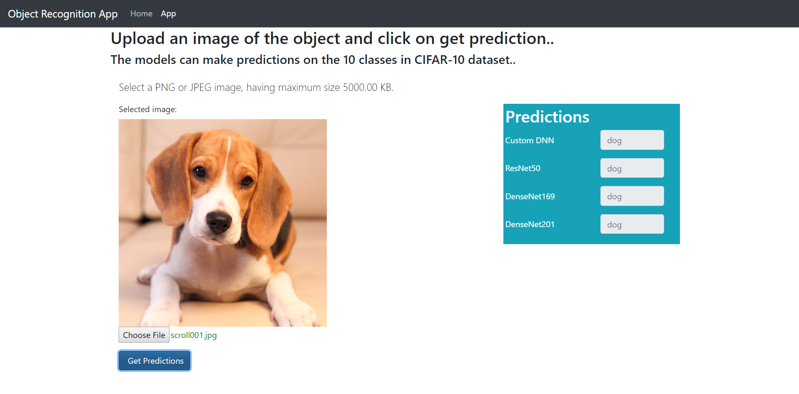

# Object recognition app
Deep learning object recognition app built in python 3.7.1 using flask, keras and tensorflow. The repo contains all the necessary config files for deployment on Google Cloud. The app makes predictions on the 10 classes in [CIFAR-10](https://www.cs.toronto.edu/~kriz/cifar.html) dataset.

All the files can be found here: [Object Recognition App](https://bitbucket.org/vrbharti1990/ora/src/master/)

The app provides a simple interface with two tabs: 
* Home tab: Shows the jupyter notebook that was used to train and save the models on cifar-10 dataset.

* App tab: Contains the actual app, where the user can upload an image and get the predcitions from all four models.

### The user can upload an image using the interface and once the image is uploaded, a preview is shown.

### When the user clicks on 'Get Predictions', the app gets the predictions from all four trained models and shows the resulting labels.

## Deployment:
To deploy the app on google cloud:
* Initialize app engine.
* Create a new app.
* Launch the cloud shell and run
> > git clone https://bitbucket.org/vrbharti1990/ora/src/master/
> > gcloud app deploy
